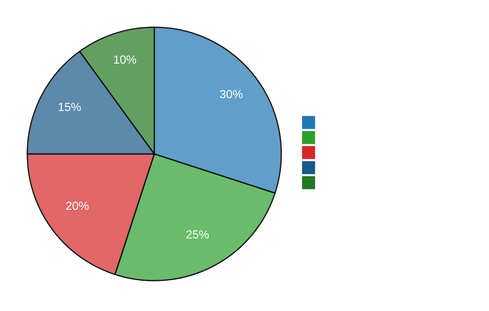

# Professional Summary

Solution Architect with **10+ years of experience** designing and delivering scalable cloud and serverless architectures that align technical strategy with business goals. Expert in AWS (Lambda, API Gateway, ECS, RDS, DynamoDB), infrastructure-as-code (Terraform, Serverless Framework, CDK), and migration strategies that reduced costs ~50% while improving reliability and scalability.

Strong track record leading cross-functional teams, defining modular monolith and testing strategies, and implementing performance and CI/CD improvements to boost stability and delivery confidence; focused on building resilient, cost-efficient platforms that enable rapid product evolution.

---

## Contact Information

| | |
|---|---|
| 📧 **Email** | eftech93@gmail.com |

| 📍 **Location** | Canada |
| 💼 **LinkedIn** | [linkedin.com/in/eftech93](https://linkedin.com/in/eftech93) |
| 🐙 **GitHub** | [github.com/eftech93](https://github.com/eftech93) |

---

## Quick Stats

---

## Featured Open Source Projects

- **[prisma-shift](https://github.com/eftech93/prisma-shift)** — TypeScript data migrations for Prisma. 352 npm downloads.
- **[dioxus-i18n-json-macro](https://github.com/eftech93/dioxus-i18n)** — Proc-macro for typed translation keys in Dioxus. 101 crates.io downloads.
- **[dioxus-ui-system](https://github.com/eftech93/rust-ds)** — Pure Rust design system for Dioxus. 84 crates.io downloads.
- **[dioxus-storage](https://github.com/eftech93/dioxus-storage)** — Type-safe IndexedDB and sync storage for Dioxus. 167 downloads across workspace crates.

---

## Currently Working On

- **dioxus-three v0.0.4** — Adding PLY and DAE format support, custom shader pipeline.
- **dioxus-storage v0.0.3** — Backend sync protocol for multi-device state reconciliation.
- **prisma-shift v0.0.4** — Distributed locking for concurrent migrations in serverless environments.

---

## About Me

- 👋 Hi, I'm @eftech93
- 👀 I'm interested in Systems Design, QA, Project Management, AI and Infrastructure
- 🌱 I'm currently pursuing a Master's in Artificial Intelligence
- 💡 Passionate about building scalable, cost-efficient platforms
- 📫 How to reach me: eftech93@gmail.com
