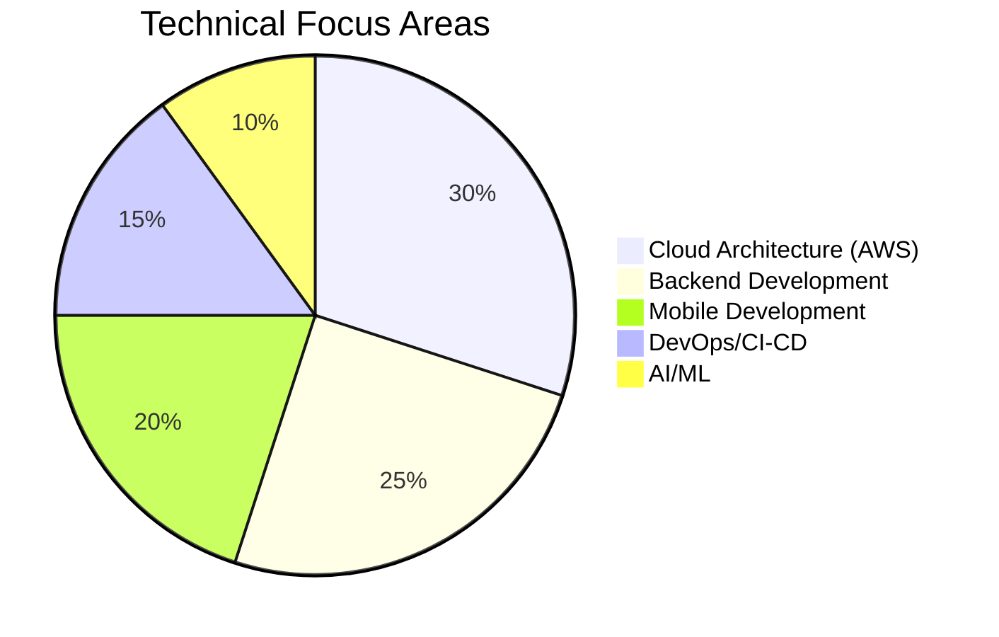

# Professional Summary

Solution Architect with **10+ years of experience** designing and delivering scalable cloud and serverless architectures that align technical strategy with business goals. Expert in AWS (Lambda, API Gateway, ECS, RDS, DynamoDB), infrastructure-as-code (Terraform, Serverless Framework, CDK), and migration strategies that reduced costs ~50% while improving reliability and scalability.

Strong track record leading cross-functional teams, defining modular monolith and testing strategies, and implementing performance and CI/CD improvements to boost stability and delivery confidence; focused on building resilient, cost-efficient platforms that enable rapid product evolution.

---

## Contact Information

| | |
|---|---|
| 📧 **Email** | eftech93@gmail.com |

| 📍 **Location** | Canada |
| 💼 **LinkedIn** | [linkedin.com/in/eftech93](https://linkedin.com/in/eftech93) |
| 🐙 **GitHub** | [github.com/eftech93](https://github.com/eftech93) |

---

## Quick Stats

---

## About Me

- 👋 Hi, I'm @eftech93
- 👀 I'm interested in Systems Design, QA, Project Management, AI and Infrastructure
- 🌱 I'm currently pursuing a Master's in Artificial Intelligence
- 💡 Passionate about building scalable, cost-efficient platforms
- 📫 How to reach me: eftech93@gmail.com
