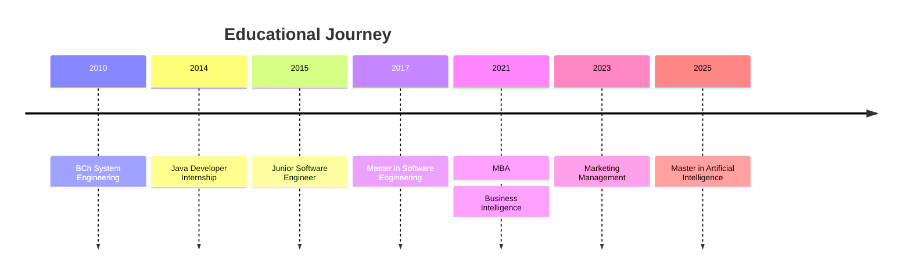

# Education & Certifications

## Academic Background

---

## Degrees

### Master of Artificial Intelligence
**UNIR - La Universidad en Internet** | Online
*April 2025 - May 2026 (Expected)*

Currently pursuing advanced studies in Artificial Intelligence, focusing on:
- Machine Learning and Deep Learning
- Natural Language Processing
- Computer Vision
- AI System Architecture

---

### Master in Comercial y Marketing Management
**ENEB - Escuela de Negocios Europea de Barcelona** | Online
*2023 - March 2024*

Business and marketing management specialization complementing technical expertise with commercial acumen.

---

### Master of Business Administration (MBA)
**UNIR - La Universidad en Internet** | Online
*November 2021 - November 2022*

Comprehensive business administration program covering:
- Strategic Management
- Financial Management
- Operations Management
- Leadership and Team Management

---

### Specialization in Business Intelligence
**UNIR - La Universidad en Internet** | Online
*November 2021 - June 2022*

Focused on data-driven decision making:
- Data Warehousing
- Data Mining
- Business Analytics
- Reporting and Visualization

---

### Master in Software Engineering
**École de technologie supérieure (ÉTS)** | Montreal, Canada
*2017 - 2018*

Advanced software engineering studies with focus on:
- Software Architecture
- Quality Assurance
- Distributed Systems
- Research Methodologies

---

### Bachelor in System's Engineering
**Universidad de Cartagena** | Colombia
*2010 - 2015*

Foundation in computer science and systems engineering:
- Software Development
- Database Systems
- Network Architecture
- Systems Analysis and Design

---

## Professional Development

### Technical Certifications & Training

| Area | Details |
|------|---------|
| **Cloud** | AWS Solutions Architecture (Practical Experience) |
| **DevOps** | Terraform, Spacelift, Serverless Framework |
| **Mobile** | Android Development, Kotlin |
| **Agile** | Scrum Master (Practitioner) |
| **Quality** | ISO 14764, S3m Standards |

---

## Languages

| Language | Level | Proficiency |
|----------|-------|-------------|
| 🇪🇸 Spanish | Native | Fluent in speaking, reading, and writing |
| 🇬🇧 English | Highly Proficient | Professional working proficiency |
| 🇫🇷 French | Highly Proficient | Professional working proficiency |

---

## Continuous Learning

I'm committed to continuous professional development through:

- 📚 **Advanced Degree Programs** - Currently pursuing Master's in AI
- 🔧 **Hands-on Experimentation** - Kubernetes using minikube on local environments
- 🌐 **Technical Communities** - Active participation in cloud and mobile development communities
- 📝 **Knowledge Sharing** - Mentoring team members and creating learning paths

> *"The only way to do great work is to love what you do."* - Steve Jobs
