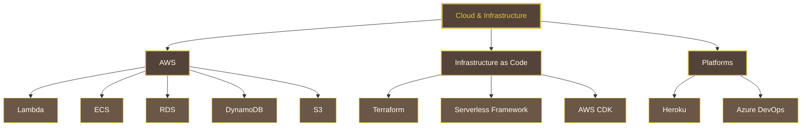
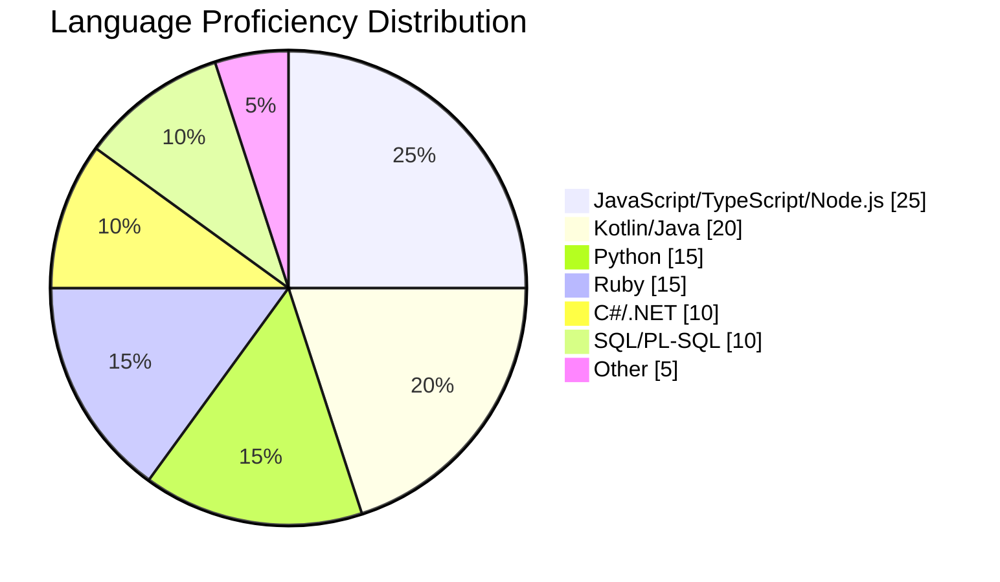

# Skills & Expertise

## Cloud & Infrastructure

| Category | Technologies |
|----------|-------------|
| **Cloud Providers** | AWS (Expert), Azure DevOps |
| **Compute** | Lambda, ECS, EC2 |
| **Database** | RDS, DynamoDB, MongoDB, PostgreSQL, Redis |
| **Storage** | S3, CloudFront |
| **Networking** | API Gateway, Route 53, ALB, CloudFront |
| **Messaging** | SNS, SQS |
| **IaC** | Terraform, Serverless Framework, AWS CDK, Spacelift |

---

## Programming Languages & Frameworks

| Category | Technologies |
|----------|-------------|
| **Backend** | Node.js, Ruby on Rails, Python, Java, C# |
| **Frontend** | ReactJS, NextJS, React Native, JSP, jQuery |
| **Mobile** | Kotlin, Java, React Native, Android SDK, Jetpack Compose |
| **Database** | SQL, PL/SQL, MongoDB Query Language |

---

## DevOps & CI/CD

| Category | Technologies & Practices |
|----------|------------------------|
| **CI/CD Tools** | GitHub Actions, Azure DevOps Pipelines |
| **IaC** | Terraform, Serverless Framework, AWS CDK |
| **Containerization** | Docker, ECS |
| **Testing** | Playwright, SonarQube, OWASP ZAP, OWASP Dependency Check |
| **Monitoring** | New Relic, Datadog, Sentry |
| **Email Testing** | Mailosaur |
| **Monorepo** | NX |

---

## Architecture & Design

- **Serverless Architecture** - Expert in designing scalable, cost-efficient serverless systems
- **Microservices** - Design and implementation of distributed systems
- **Modular Monolith** - Rails + Packwerk for domain separation
- **Clean Architecture** - MVVM, Clean Architecture patterns
- **API Design** - RESTful APIs, GraphQL
- **Mobile Architecture** - Native Android, Cross-platform (React Native)

---

## Testing & Quality Assurance

| Type | Tools & Frameworks |
|------|-------------------|
| **Unit Testing** | Jest, RSpec, JUnit |
| **E2E Testing** | Playwright |
| **Code Quality** | SonarQube |
| **Security** | OWASP ZAP, OWASP Dependency Check |
| **Test Coverage** | 70%+ coverage implementation |

---

## Methodologies & Practices

```mermaid
flowchart LR
    A[Agile/Scrum] --> B[CI/CD]
    B --> C[DevOps]
    C --> D[Infrastructure as Code]
    D --> E[Security First]
    E --> F[Performance Optimization]
    
    style A fill:#534339,stroke:#DEC647,stroke-width:2px,color:#FFFCF3
    style B fill:#534339,stroke:#DEC647,stroke-width:2px,color:#FFFCF3
    style C fill:#534339,stroke:#DEC647,stroke-width:2px,color:#FFFCF3
    style D fill:#534339,stroke:#DEC647,stroke-width:2px,color:#FFFCF3
    style E fill:#534339,stroke:#DEC647,stroke-width:2px,color:#FFFCF3
    style F fill:#534339,stroke:#DEC647,stroke-width:2px,color:#FFFCF3
```

- **Agile/Scrum** - Certified practitioner and implementer
- **Technical Leadership** - Team mentoring, code reviews, architectural decisions
- **RFC Process** - Authoring and driving technical proposals
- **ISO Standards** - ISO 14764, S3m for software maintenance
- **KPI Definition** - Team performance metrics and monitoring

---

## AI & Emerging Technologies

| Area | Technologies & Concepts |
|------|------------------------|
| **AI/ML** | NLP, Computer Vision |
| **Cloud AI** | AWS AI Services |
| **Automation** | AI-driven documentation extraction |
| **Mobile AI** | AI-driven components for mobile apps |

---

## Soft Skills

- **Technical Leadership** - Leading cross-functional teams, mentoring engineers
- **Architecture Decision Making** - RFC authoring, technical strategy
- **Client Relations** - Discovery, requirements gathering, cost analysis
- **Team Building** - Hiring, onboarding, intern mentoring
- **Stakeholder Communication** - Technical presentations, executive summaries

---

## Languages

| Language | Proficiency |
|----------|-------------|
| 🇪🇸 Spanish | Native |
| 🇬🇧 English | Highly Proficient |
| 🇫🇷 French | Highly Proficient |
